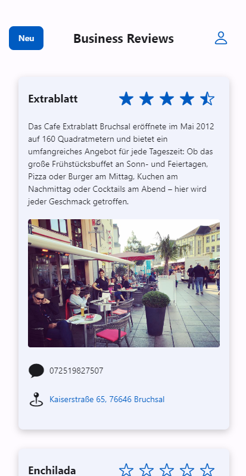

# Business Reviews Platform

## Introduction
The Business Reviews platform is a web-based application that connects customers with businesses. It allows users to browse various businesses, read reviews, and submit their own feedback. This platform is particularly useful for finding local services or restaurants.

## Core Features

### Business Listing
- Users can browse a list of businesses.
- Each business has a detailed profile with information like services offered, location, and contact details.

### Reviews and Ratings
- Customers can rate businesses on a scale of 1 to 5 stars.
- Users can read reviews from others or write their own to share their experiences.

## Technical Details

### Backend
- I used a Docker image and a docker-compose file for setting up the backend.
- *Pocketbase* is used for data management, ensuring data is stored and accessed securely.

```yml
version: '2'
services:
  pocketbase:
    image: ghcr.io/muchobien/pocketbase:latest
    container_name: pocketbase
    restart: unless-stopped
    command:
      - --encryptionEnv #optional
      - ENCRYPTION #optional
    environment:
      - ENCRYPTION=example #optional
    ports:
      - "8090:8090"
    volumes:
      - /var/www/vhosts/<V_HOST>/pocketbase/data:/pb_data

```

### Notifications
- The platform can send real-time notifications to users about updates or new reviews using a Node.js script. This script can be seen in [push_notification_sender.js](./push_notification_sender.js). 

### Frontend
- The application is built with React, offering a responsive and user-friendly interface.
- Key pages include:
  - **[HomePage](./src/pages/HomePage.jsx):** Displays the [BusinessList](./src/components/BusinessList.jsx) made from [BusinessItems](./src/components/BusinessItem.jsx).
    Home Page | Business Item
    :-------------------------:|:-------------------------:
     | 
  - **[BusinessPage](./src/pages/BusinessPage.jsx):** Shows detailed information about a specific business as [BusinessItem](./src/components/BusinessItem.jsx) and its [RatingsList](./src/components/RatingsList.jsx).
    Business Page | Rating List
    :-------------------------:|:-------------------------:
     | 
  - **[CreateBusinessPage](./src/pages/CreateBusinessPage.jsx):** Allows business owners to add their business to the listing.
    Business Page | .
    :-------------------------:|:-------------------------:
     | 
  - **[LoginPage](./src/pages/LoginPage.jsx) & [ProfilePage](./src/pages/ProfilePage.jsx):** Manages user login and profile information.
    Login Page | Profile Page
    :-------------------------:|:-------------------------:
     | 
- To display errors that might arise in every page or component, a centralized [event emitter](./src/js/eventemitter.js) is used. The [MainAppComponent](./src/components/MainAppComponent.jsx) subscribes to the emitter and displays a global error message for 3 seconds at the top of the screen.

## Conclusion
The Business Reviews platform is a straightforward tool for discovering and reviewing businesses. It's designed to be simple yet effective, providing valuable insights about local services and eateries to users. It's a practical project that demonstrates the integration of modern web technologies.
